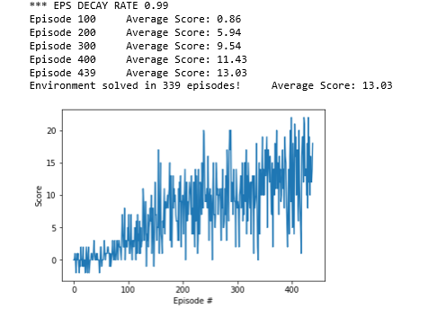

# Introduction
This report outlines the implementation of a learning Agent to navigate a large square world populated by blue and yellow bananas that in random positions where collected bananas are  replenished in random positions within the world.

The aim of the agent is to collect only the yellow bananas and, where possible, avoid collecting blue bananas.

Within this world, Agents are rewarded (+1 reqard) when it collects a yellow banana and penalised (-1 reward) when they collect a blue banana.

An Agent is deemed to have successfully completed the task if they score 13 or more on average across 100 consecutuive episodes.

The environment is a 37-dimention State space containing various details about the current state including the agent's velocity and ray based perception of objects in front of the agent. At any given step in an episode the Agent can take one of 4 actions (forwards, backwards, turn left or turn right).

The environment is continous with new bananas being dropped in random positions to replenish collected bananas. The number of bananas in the environment is not configurable and based on the visual presentation of the environment there is a large number of bananas in the world at any given time.

# Implementation of the Learning Agent
The Agent attempts to learn how to navigate the world in a step by step manner. At each step it recieves details about the environment and any rewards for the previous action. Based on these numeric values the agent attempts to learn what actions increase the reward and what actions do not.
The Agent has no prior knowledge about how to navigate the environment (i.e. what the actions do) or what actions in a given state will result in a positive reward.

The Agent was trained across a number of Episodes where, since the environment is continous, the number of steps was limited to a maximum of 1,000 steps. 

The Agent uses a Deep Q-Learning algorithm (see next secton) to learn about the environment and at each step, the Agent chooses an action (based on it's current understanding) and in return recieves details of the new environment state and any reward (positive or negative). This informaiton is then used to update the Q-Table (or more specifcally the function that approximates the Q-Table).

Learning continues until either:
* the number of steps reaches the maximum specified
* the agent has scored an average of 13 over the last 100 episodes.

# Description of the Learning Algorithm
The Agent uses a Deep Q-Learning Network or DQN to approximate the Q-Table based on the orignal paper from DeepMind (https://storage.googleapis.com/deepmind-media/dqn/DQNNaturePaper.pdf).

The DQN approximates the Action-Value function and avoids the need for large Q-Tables in environments that have a large state space. In traditional Q-Learning a table is maintained that is used to track states and for each state the expected value of taking an action at that state.

For small state-spaces such a table based approach is suitable but for larger state spaces this become impractical and ineffient to manage. To resove this the Q-Table is replaced by a function approximater (a Neural Network) to

The Agent used a Deep Neural Network to approximate the Q-Table. The Neural Network was a simple multi-layer network that had multiple fully connected hidden layers.

The final model used the following Architecture:

|Input Layer|Hidden Layer Configuration|Output Layer|
|---|---|---|
| 37 | 64 -> 64 | 6 |

This was based on a number of experiments to tune the architecure and paramters (see subsequent section on Tuning the Agent)

The implemenation of the Learning Algorithm uses the following additional features:
* Experience Replay
* Fixed Q-Targets
These help to stablise the neural network used to approximate the action-value function and are described in the following section.

## Experience Replay
This environment the observations that an agent recieves at a given point is strongly corrolated to the previous observation. For example if an Agent chooses the action to move forward, then the ray-traced perception of the world in front of the agent will, in general, be similar to the previous state (only items will be closer and possibly some new distant objects visible). This can cause issues with the network converging since the corrolation between steps sequences of steps is being encoded into the network. Research suggsts that the network will converge better if the observations are independant and uniformly distributed. 

To implement this propery, the Agent implements a tactic called Experience Replay where the network is updated using a subset of previous experiences that selected randomly. This breaks the corrolation between observations.

In this implemenation, we used a buffer to hold the last 100000 observations and rather than learning from the current observation, the current observation is added to the buffer but a randomly selected observation from the buffer is used for learning.

### Fixed Q-Targets
During the early stages of training the Q values are changing rapidly and the Agent doesn't have sufficient information to find the next best action (since learning will be based on what has been explored so far). This can lead to wild oscilations in weights during the earlier stages of learning and a network that is slower to converge and a general over estimation of the Q-Values.

To allievate this a Fixed Q-Target network is used that is synchronised with the active Q-Target network periodically (rather than on every step). The action selected by the Agent is made using the active Q-Network but the action is evaluated using the Fixed Q-Target network. In this way the DQN learning evolves based on the agreement of the two networks.

# Tuning the Agent
A series of experiements were conducted to understand the impact of different parameters and architectures for the learning.

These experiements focused on the following dimentions:
* EPS Start value
* EPSE End value
* EPSE Decay rate
* Number of Hidden Layers in the DQN
* Size of Hidden Layers in the DQN

An initial baseline was selected (based on intuition) that trained the agent in 435 episodes. Each of the subsequent experiments conducted changed a single factor around the baseline configuration to understand it's impact.

The inital baseline had the configuration
|EPS Start|EPSE End|EPSE Decay Rate|Hidden Layers Configuration|
|---|---|---|---|
|1.0|0.0001|0.995| 64 -> 64|

This yielded the following Plot of rewards for the baseline configuration
 and network architecutres (depth and size) and yielded the following information:
* EPS Decay Rates: the agent learned best with a decay rate of 0.99; the baseline decay rate (0.995) was only slightly higher but the lower value resulted approximately 100 fewer episodes
* EPS Start: the baseline performed better than the selected EPS start points
* EPS End: the baseline performed better than the selected EPS end points
* Network Depth and Size: increasing the size of the hidden layers did improve the learning. Increasing the depth of the network provided some improvements to the learning in terms of reducing the number of Episodes needed but training was slightly slower. IT was found that having 3 hidden layers of 64 inputs each reduced the number of episodes by 50.

Based on these the Agent was configured as follows
|EPS Start|EPSE End|EPSE Decay Rate|Hidden Layers Configuration|
|---|---|---|---|
|1.0|0.0001|0.99| 64 -> 64 -> 64|

# Plot of Rewards
The following image shows the plot of rewards over time during the learning phase based on the following set of hyperparameters and network architecture:

|EPS Start|EPSE End|EPSE Decay Rate|Hidden Layers Configuration|
|---|---|---|---|
|1.0|0.0001|0.99| 64 -> 64 ->64|

The overall result was that the Optimised Agent completed the challenge in 266 Episodes.

The combination of Decay rate and increased network depth has had a considerable impact on the number of episodes required for the Agent to complete the challenge.

While the optimised Agent achieves the criteria for this world, reviewing the reward plot for the Optimised Agent indicates quite a range of scores with some very high scores (20) and some very low scores (0). On average the criteria is being met but the range of scores over the last 100 episodes of the training indicates that the Agent is not stable and reliable in its actions. In particualr when observing the training Agent operating it was noted that sometimes the Agent gets into a loop between two oposing actions (e.g. turn left and turn right or forward and backwards); once it enters into this loop it does not break out of it until the max number of steps is reached. When this happens early in an episode, the Agent returns a low score.

# Ideas for Future Work
The current implementation of the DQN uses the following enhancements:
* Experience Replay
* Target Q-Network
While these enhancements improve the performance of the DQN there are additional enhancements that could be used:
* Prioritiezed Experience Replay: this is where we capture a priority for the experience based on the difference between TD-Target and TD-Estimate. This allows for experiences where we have the most to learn from have a greater chance of being selected for the learning phase. 
* Dualling DQN: this is where one network holds the state value and another network holds the advantage values.

These techniques could improve the learning of the agent and stabilse the learning.

Additional experiments could be conducted but were omitted due to time constraints. These include:
* Replay buffer size
* Learning Batch Size
* Gamma
* Learning Frequency
* Using features such as Dropdown in the Neural Network
* Using different activation functions

Additionally, based on the observation of the Agent's behavour where it loops between two observations it may be worthwhile providing some more guided examples that train the network on scenarios that contain these loops. Another option might be to monitor the states and detect when we repeat the same action and observation loop a number of times to select a ( a sequence of) random action or a sub-optimal action to break out of the cycle.
